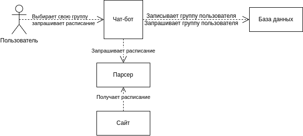

# Telegram-bot с расписанием SPbPU

## Требования к задаче
1. Должен быть реализован бот с использованием библиотеки telebot
2. Должен быть реализован класс базы данных для возможности запоминания номера группы пользователя
3. Требования к чат-боту:
    - Должна быть возможность выбора расписания по институту, по номеру курса, по группе
    - Бот должен запоминать выбор группы пользователя
    - Бот должен иметь команду для получения расписания на текущий день
    - Должна быть возможность выбора расписания на неделю
      - Также должна быть возможность смены недели (выбор прошлой недели, текущей или одной из двух последующих)

## Наша команда

### Группа - 5130904/10103

| Имя | Задача |
------------|---------|
| Бокий А. | Команда - выбор группы в телеграм боте |
| Ивличева К. | Создание класса БД; Команды - получения расписания на недели |
| Курзов А. | Создание парсера расписания группы с сайта ruz.spbstu.ru |
| Майстренко Д. | Создание парсера начальных страниц сайта ruz.spbstu.ru |

## Использование

В телеграм боте 3 команды.

1. `/start` - Выбор группы.
2. `/schedule` - Расписание на сегодня.
3. `/schedule_week` - Окно выбора недели расписание на выбранный день. 

## Примеры

- Пример выбора группы ([ссылка](./docs/choose_group_ex.md))
- Пример получения расписания ([ссылка](./docs/schedule_output_ex.md))

## Диаграмма

