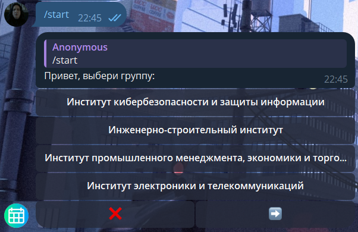
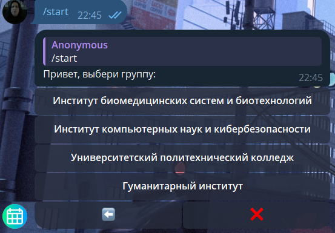
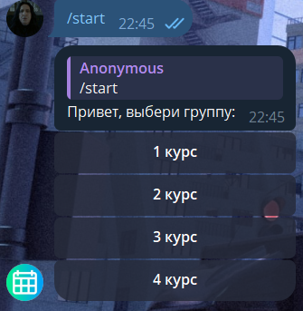
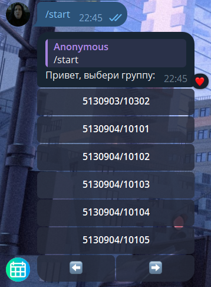
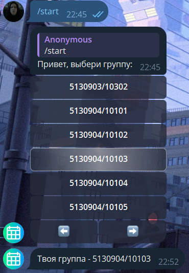

# Пример выбора группы в телеграм боте:

1. Команда `/start`. Видим окно выбора института

2. Выбираем 2 институт - Институт компьютерных накут и кибербезопасности 

3. Выбираем наш курс - 3 курс

4. Выбираем нашу группу: листаем кнопками снизу

5. Выбрали группу. Теперь бот запомнил группу

