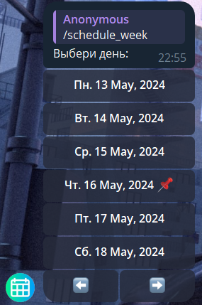
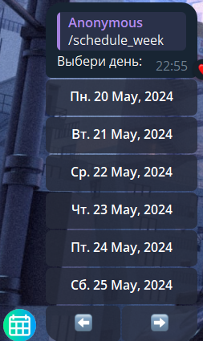
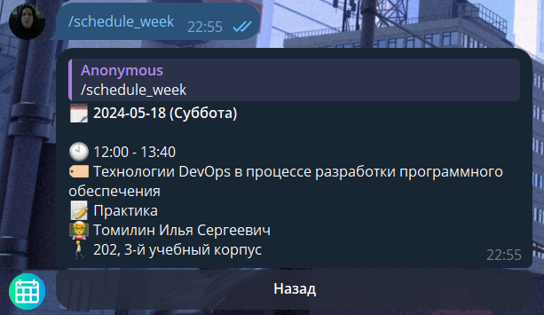

# Пример получения расписания в телеграм боте:

1. Команда `/schedule_week`. Видим окно выбора дня. Можно выбрать день на прошлой, текущей, следующей неделях.

2. Например получим расписание на субботу следующей недели:

